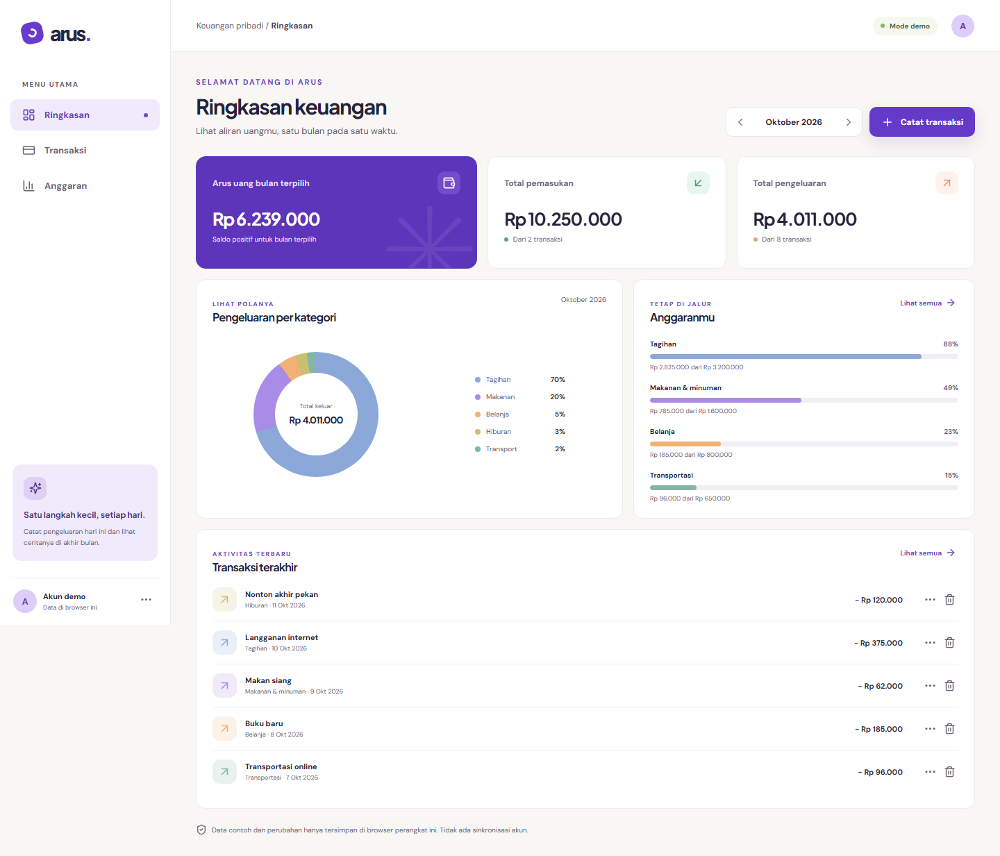

# Arus — personal finance demo

Arus is a responsive personal finance demo for recording income and expenses, reviewing monthly cash flow, and setting category budgets in Indonesian rupiah.

[Open demo](https://arus-web.vercel.app/app) · [Landing page](https://arus-web.vercel.app/) · [Source](https://github.com/Wridho788/arus) · [Case study](docs/portfolio/CASE_STUDY.md)



## Features

- Transaction create, edit and delete, with type/category filters and text search.
- One shared month selection for dashboard, transactions and budgets.
- Category budgets with remaining amounts and visible overspending.
- Demo seed data, reload persistence and a confirmed reset action.
- Inline validation, storage-failure feedback and deliberate data recovery.
- Responsive layouts, keyboard navigation and dialog focus management.

## Data and limitations

Records are stored only in `localStorage` for the current browser and origin. Clearing site data removes them. There are no accounts, cloud backup, cross-device sync, bank connections or payments. Example data is visibly labeled. Arus is a portfolio demo, not a financial service.

Amounts use integer rupiah and dates use local calendar strings. Only the repository accesses browser storage; derived totals are recalculated from records. A failed save does not publish a new UI state.

## Run locally

Use Node.js 22.12 or later on a supported current Node release.

```powershell
npm ci
npm run dev
```

No API keys or environment files are required. Google Fonts is used for typography; browser fallback fonts apply if it is unavailable.

## Checks and production preview

```powershell
npm run typecheck
npm run lint
npm run test
npx playwright install chromium
npm run test:e2e
npm run build
npm run test:production
npm run preview
```

Development E2E runs against Vite with React Strict Mode. Production E2E serves the existing `dist/` build on port 4175. Run the build first. See [Development](docs/DEVELOPMENT.md) for public-deployment checks and screenshot capture.

## Verified status

Tasks 1–5 are complete. On **2026-10-04**, production preview passed **23 Chromium tests**, and the existing Vercel deployment passed **two desktop/phone smoke journeys**. The public landing and direct `/app` route returned HTTP 200. Public JS/CSS matched the local build by SHA-256. Earlier domain/repository verification passed 12 unit tests.

Viewport checks cover 360px, 768px and 1440px. Physical-device, Safari, Firefox and assistive-technology testing remain unverified. Full evidence and reproduction commands are in the [release verification](docs/portfolio/RELEASE_VERIFICATION.md).

## Portfolio and documentation

- [Case study](docs/portfolio/CASE_STUDY.md): problem, scope, design/storage decisions and outcomes.
- [Screenshot package](docs/portfolio/README.md): nine final screenshots, captions and capture instructions.
- [PRD](docs/PRD.md): users, scope, journeys and acceptance criteria.
- [Architecture](docs/ARCHITECTURE.md): boundaries, modules and data flow.
- [TRD](docs/TRD.md): model, persistence and quality requirements.
- [Development](docs/DEVELOPMENT.md): setup, tests and release workflow.
- [Milestones](docs/MILESTONES.md): completed work and remaining handoff.
- [MVP verification](docs/VERIFICATION.md): task 2–3 findings and evidence.

Stack: React, TypeScript, Vite, CSS, localStorage, Vitest, Playwright and Vercel.

Visual inspiration: [Outcrowd's personal finance landing page](https://dribbble.com/shots/26496450-Promo-Landing-Page-for-a-Personal-Finance-Platform). The layout, product copy and CSS illustrations were implemented for Arus; icons use Lucide.
