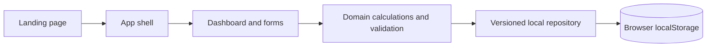

# Architecture — Arus

## System boundary

Arus is a static React web app. All product data lives in browser storage for the current origin. There is no server-side API and no account identity. A fresh browser receives demo records; an existing browser loads its saved records.

## Module responsibilities

- **Presentation:** responsive landing page, app navigation, dashboard, transaction and budget forms, list, and feedback states.
- **Domain:** validates positive integer amounts and required fields; calculates monthly totals, category spend, and budget progress from raw records.
- **Repository:** parses and validates the persisted envelope, seeds first-visit data, and writes complete snapshots. UI code does not access `localStorage` directly.
- **Tests:** pure calculation tests plus browser tests covering persistence and the main CRUD journeys.

## Data flow

On start, the repository reads a versioned snapshot. If no snapshot exists, it creates example data and persists it. A mutation produces a new snapshot, validates it, writes it, and only then publishes it to the UI. Derived figures are recalculated from the current snapshot; they are never stored separately.

If storage access fails or stored data has an unsupported shape, Arus reports the problem and offers a deliberate reset. It does not silently overwrite existing data. Deletion and reset require confirmation.

## Responsive behavior

The landing page has a compact phone layout and a wider desktop story. In the app, navigation condenses on phones, summary cards stack, and transaction rows become touch-friendly cards. At larger widths, the dashboard uses multiple columns. The same feature set remains available on every viewport.

## Boundaries and trade-offs

Local storage makes the demo fast and deployable as static files, but data is tied to one browser and can be removed by the browser or the user. It is not a backup, secure vault, or shared database. Example entries are visibly labeled as demo content. The repository boundary allows a future persistence replacement without rewriting calculations or screens.
