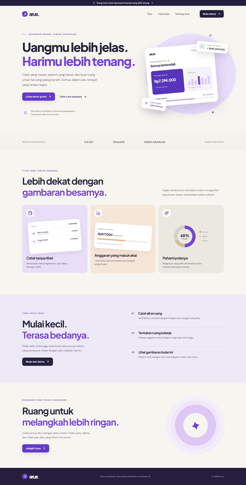
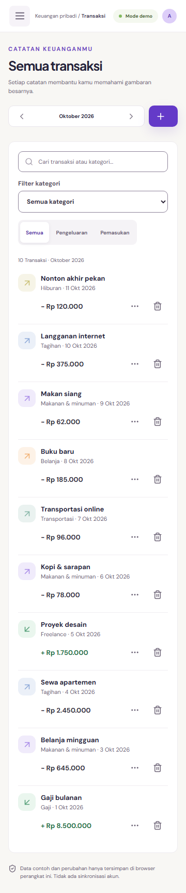

# Arus — Pencatatan keuangan pribadi yang sederhana

[Buka demo](https://arus-web.vercel.app/app) · [Landing page](https://arus-web.vercel.app/) · [Source code](https://github.com/Wridho788/arus)

Arus adalah proyek portofolio berbasis React dan TypeScript untuk mencatat pemasukan, pengeluaran, serta anggaran bulanan dalam rupiah. Pengunjung dapat langsung mencoba alur lengkap dengan data contoh, tanpa membuat akun.

## Masalah dan tujuan

Catatan transaksi yang tersebar membuat gambaran pengeluaran bulanan sulit dibaca. Arus dirancang untuk membantu individu melihat tiga hal dalam satu tempat: uang yang masuk, uang yang keluar, dan pemakaian anggaran per kategori.

Target MVP adalah alur pencatatan yang singkat, total yang langsung diperbarui, dan tampilan yang tetap dapat digunakan dari ponsel sampai desktop. Proyek ini menggunakan skenario dan data contoh; belum ada riset pengguna atau pengukuran dampak finansial pada pengguna nyata.

## Alur produk

Pengunjung masuk melalui landing page, membuka demo, lalu melihat ringkasan bulan terpilih. Mereka dapat menambah, mengedit, atau menghapus transaksi; mencari catatan; dan memfilter jenis serta kategori. Anggaran membandingkan batas pengeluaran dengan transaksi yang cocok pada kategori dan bulan yang sama, termasuk ketika pengeluaran melebihi batas.

## Keputusan desain dan teknis

**Penyimpanan lokal untuk lingkup demo.** Data disimpan sebagai satu snapshot JSON berversi di `localStorage`. Pilihan ini memungkinkan hosting statis dan pengalaman tanpa registrasi. Konsekuensinya, data terikat pada browser dan origin yang digunakan; tidak tersedia backup atau sinkronisasi perangkat.

**Perubahan terlihat setelah penyimpanan berhasil.** UI memanggil repository untuk memvalidasi dan menyimpan snapshot baru. State baru ditampilkan setelah penulisan berhasil. Jika storage gagal, form tetap terbuka, input dipertahankan, dan pesan error muncul di dalam form. Data rusak atau versi yang tidak dikenali tidak ditimpa diam-diam.

**Perhitungan berasal dari transaksi.** Total pemasukan, pengeluaran, arus bersih, dan pemakaian anggaran dihitung ulang dari catatan yang tersimpan. Nilai rupiah memakai integer, sedangkan tanggal disimpan sebagai kalender lokal `YYYY-MM-DD` agar transaksi tidak berpindah bulan akibat konversi UTC.

**Tampilan menyesuaikan tugas.** Desktop menggunakan beberapa kolom untuk ringkasan; ponsel memakai susunan vertikal dan kartu transaksi dengan judul yang dapat membungkus. Filter tidak mengubah total dashboard. Penjelasan penyimpanan lokal dan mode demo tetap terlihat.

## Temuan selama pengembangan

Pengujian browser menemukan dialog yang langsung tertutup akibat siklus effect React Strict Mode. Perbaikan membedakan event penutupan cleanup dari penutupan yang diminta pengguna. Tes keyboard juga mendorong penanganan fokus yang eksplisit: fokus awal pada isian, Tab tetap di dialog, Escape menutup form, dan fokus kembali ke tombol pembuka.

Skenario kegagalan storage diperlakukan sebagai bagian dari alur produk: pengguna dapat mencoba menyimpan kembali, membuka ulang data setelah izin storage dipulihkan, atau melakukan reset dengan konfirmasi.

## Verifikasi dan batas hasil

Hasil pengujian production preview dan deployment dicatat di [laporan rilis](RELEASE_VERIFICATION.md). Pengujian mencakup CRUD, penyimpanan setelah reload, perhitungan anggaran, kondisi gagal, keyboard, dan viewport 360, 768, serta 1440 piksel. Screenshot berasal dari build produksi dengan data contoh Oktober 2026; bukan mockup fitur yang belum dibuat.

Verifikasi browser menggunakan Chromium. Perangkat fisik, Safari, Firefox, dan pengujian dengan teknologi bantu belum diverifikasi. Arus tidak menyediakan koneksi bank, pembayaran, akun, cloud backup, atau nasihat investasi.

## Ringkasan untuk kartu portofolio

> Arus adalah demo pencatatan keuangan pribadi dengan dashboard bulanan, CRUD transaksi, dan anggaran kategori. Dibangun menggunakan React, TypeScript, dan Vite, dengan penyimpanan lokal, penanganan kegagalan storage, serta pengujian alur pengguna pada desktop dan ponsel.

Stack: React · TypeScript · Vite · CSS · localStorage · Vitest · Playwright · Vercel.

Referensi visual awal: [Personal Finance Platform oleh Outcrowd](https://dribbble.com/shots/26496450-Promo-Landing-Page-for-a-Personal-Finance-Platform). Layout, copy produk, dan ilustrasi CSS diimplementasikan untuk Arus; ikon menggunakan Lucide.
